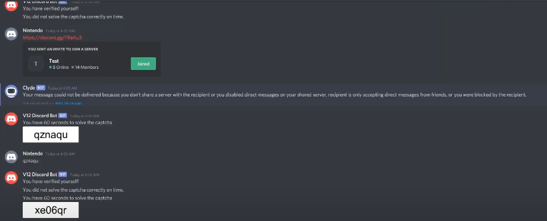

# CAPTCHA NO DISCORD
🤖ESTE É UM BOT DO DISCORD FEITO COM DISCORDJS. O BOT IMPLEMENTA UM SISTEMA DE CAPTCHA PARA NOVOS MEMBROS QUE ENTRAM EM UM SERVIDOR NO DISCORD.

 <br>

## DESCRIÇÃO:
O bot implementa um sistema de captcha para novos membros que entram em um servidor no Discord. O objetivo é verificar se o novo membro é um humano ao resolver um desafio de captcha simples.

## EXECUTANDO O PROJETO:
1. **Editar o código:**
   - Substitua `seu_token_aqui` pelas suas credenciais corretas, que podem ser obtidas no [Discord Developer Portal](https://discord.com/developers/applications), no arquivo `CODIGO/src/.env`.

2. **Instalando as Depêndencias:**
   - Para instalar as dependências listadas no arquivo "package.json", você pode usar o comando `npm install` no terminal. Certifique-se de estar no diretório do seu projeto onde o arquivo "package.json" está localizado (`CODIGO`). O npm irá ler o arquivo "package.json" e instalar todas as dependências listadas nele. 

   ```bash
   npm install
   ```

3. **Inicie o Bot:**
   - Para usar o `NODE`, inicie o bot com o seguinte comando:
    ```bash
    npm start
    ```

    - Para usar o `NODEMON`, inicie o bot com o seguinte comando:
    ```bash
    npm test
    ```
    
4. **Funcionamento**:
   - Quando um novo membro entra no servidor Discord, o bot gera um captcha aleatório usando a função `createCaptcha` definida no segundo código que você forneceu. Esse captcha é uma imagem PNG gerada dinamicamente com um texto aleatório.
   - O bot envia a imagem do captcha para o novo membro através de uma mensagem privada, junto com instruções para resolver o captcha em até 60 segundos.

5. **Verificação do Captcha**:
   - O bot aguarda a resposta do novo membro. A resposta deve ser enviada exatamente como o texto do captcha gerado.
   - Se o membro inserir corretamente o texto do captcha dentro do tempo limite (20 segundos no exemplo), o bot concede ao membro o papel especificado (`640340203763925002`) e exclui o arquivo de captcha gerado.
   - Caso contrário, se o membro não resolver corretamente o captcha dentro do tempo limite, o bot remove o membro do servidor.

6. **Tratamento de Erros**:
   - O bot lida com possíveis erros, como a falha na resolução do captcha dentro do tempo limite ou erros na comunicação com o membro.
  
## NÃO SABE?
- Entendemos que para manipular arquivos em muitas linguagens e tecnologias relacionadas, é necessário possuir conhecimento nessas áreas. Para auxiliar nesse aprendizado, oferecemos cursos gratuitos disponíveis:
* [CURSO DE DISCORDJS](https://github.com/VILHALVA/CURSO-DE-DISCORDJS)
* [CURSO DE JAVASCRIPT](https://github.com/VILHALVA/CURSO-DE-JAVASCRIPT)
* [CURSO DE NODEJS](https://github.com/VILHALVA/CURSO-DE-NODEJS)
* [CONFIRA MAIS CURSOS](https://github.com/VILHALVA?tab=repositories&q=+topic:CURSO)

## CREDITOS:
- [PROJETO CRIADO PELO "stuyy"](https://github.com/stuyy/discordjs-youtube-tutorials/tree/master/captcha-bot)
- [VEJA O VIDEO DESSE PROJETO](https://youtu.be/g1Hv1vIL760?si=lYDmxnmd3mm4lMgm)
- [PROJETO FEITO PELO VILHALVA](https://github.com/VILHALVA)

